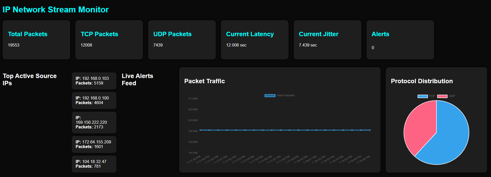

# IP Network Stream Monitor & Fault Detector

Real-time network traffic monitoring and anomaly detection dashboard built using Python, FastAPI, Scapy, SQLite, WebSockets, and Chart.js.

The system captures live TCP/UDP packets, performs traffic analytics, detects abnormal traffic behavior using threshold-based monitoring, and visualizes network activity through a live dashboard.

---

# Table of Contents

- [Project Overview](#project-overview)
- [Features](#features)
- [System Architecture](#system-architecture)
- [Workflow Explanation](#workflow-explanation)
- [Technologies Used](#technologies-used)
- [Folder Structure](#folder-structure)
- [Dashboard Preview](#dashboard-preview)
- [Installation & Setup](#installation--setup)
- [Running the Project](#running-the-project)
- [Dashboard Features](#dashboard-features)
- [Example Fault Detection Events](#example-fault-detection-events)
- [Future Improvements](#future-improvements)
- [Learning Outcomes](#learning-outcomes)
- [Author](#author)

---

# Project Overview

The IP Network Stream Monitor & Fault Detector is a real-time network observability and monitoring platform designed to analyze live network traffic streams.

The system continuously captures packets from the network interface using Scapy, extracts protocol-level information, stores traffic logs in SQLite, detects abnormal traffic patterns, and streams analytics to a live monitoring dashboard.

The project demonstrates concepts related to:

- Network Packet Sniffing
- Traffic Monitoring
- Protocol Analysis
- Fault/Anomaly Detection
- Real-Time Backend Systems
- FastAPI API Development
- WebSocket Communication
- Dashboard Visualization
- Network Analytics

---

# Features

## Real-Time Packet Sniffing
- Captures live TCP and UDP packets using Scapy
- Continuously monitors network traffic streams
- Extracts real-time packet metadata

## Protocol Parsing
The parser extracts:
- Source IP
- Destination IP
- Source Port
- Destination Port
- Packet Size
- Protocol Type
- TCP Flags

## SQLite Packet Logging
- Stores packet logs persistently
- Maintains historical traffic records
- Enables analytics queries

## Real-Time Dashboard
The dashboard provides:
- Total packet monitoring
- TCP packet monitoring
- UDP packet monitoring
- Traffic visualization
- Protocol analytics

## Protocol Distribution Analytics
- Displays TCP vs UDP traffic distribution
- Uses Chart.js pie chart visualization

## Traffic Visualization
- Live packet traffic graph
- Real-time dashboard updates
- Dynamic analytics rendering

## Top Active Source IP Analytics
- Identifies top traffic-generating IP addresses
- Uses SQL aggregation queries

## WebSocket-Based Live Alerts
- Streams alerts in real time
- Event-driven monitoring architecture

## Threshold-Based Fault Detection
The system performs anomaly detection using:
- Packet burst detection
- Traffic spike monitoring
- Jitter spike detection
- Latency anomaly detection

---

# System Architecture

## High-Level Architecture

```text
                +----------------------+
                |   Network Traffic    |
                +----------+-----------+
                           |
                           v
                +----------------------+
                |   Scapy Packet       |
                |      Sniffer         |
                +----------+-----------+
                           |
                           v
                +----------------------+
                |    Packet Parser     |
                +----------+-----------+
                           |
                           v
                +----------------------+
                | Fault Detection &    |
                | Traffic Analytics    |
                +----------+-----------+
                           |
          +----------------+----------------+
          |                                 |
          v                                 v
+----------------------+       +----------------------+
| SQLite Database      |       | WebSocket Alerts     |
| Packet Logging       |       | Real-Time Streaming  |
+----------+-----------+       +----------+-----------+
           |                                 |
           +----------------+----------------+
                            |
                            v
                +----------------------+
                | FastAPI Backend API  |
                +----------+-----------+
                           |
                           v
                +----------------------+
                | Live Dashboard UI    |
                | Chart.js Analytics   |
                +----------------------+
```

---

# Workflow Explanation

## Step 1 — Packet Capture
The system captures live network packets using Scapy raw sockets.

Packets flowing through the network interface are continuously monitored and forwarded to the processing pipeline.

---

## Step 2 — Packet Parsing
Captured packets are parsed to extract:
- IP addresses
- Ports
- Protocol types
- Packet sizes
- TCP flags

This converts raw packets into structured packet data.

---

## Step 3 — Packet Logging
Structured packet data is stored in SQLite database for:
- persistent storage
- monitoring
- analytics querying

---

## Step 4 — Fault Detection
The detector module analyzes traffic behavior to identify:
- packet bursts
- abnormal traffic spikes
- jitter spikes
- latency anomalies

Threshold-based monitoring logic is used for anomaly detection.

---

## Step 5 — Backend API Layer
FastAPI provides backend APIs for:
- metrics
- analytics
- dashboard updates
- IP statistics

---

## Step 6 — WebSocket Communication
WebSockets stream live alerts directly to the dashboard without requiring manual refreshes.

---

## Step 7 — Dashboard Visualization
The dashboard visualizes:
- packet counts
- traffic trends
- protocol distribution
- active source IPs
- live analytics

using Chart.js and dynamic JavaScript updates.

---

# Technologies Used

| Technology | Purpose |
|---|---|
| Python | Backend Development |
| FastAPI | Backend APIs |
| Scapy | Packet Sniffing |
| SQLite | Database Storage |
| WebSockets | Real-Time Communication |
| HTML/CSS/JavaScript | Dashboard UI |
| Chart.js | Data Visualization |

---

# Folder Structure

```text
network-stream-monitor/
│
├── app/
│   ├── __init__.py
│   ├── main.py
│   ├── sniffer.py
│   ├── parser.py
│   ├── detector.py
│   ├── database.py
│   ├── metrics.py
│   └── websocket_manager.py
│
├── dashboard/
│   └── index.html
│
├── screenshots/
│   └── dashboard_overview.png
│
├── requirements.txt
├── README.md
├── .gitignore
```

---

# Dashboard Preview



---

# Installation & Setup

## Step 1 — Clone Repository

```bash
git clone <your-github-repository-url>
cd network-stream-monitor
```

---

## Step 2 — Create Virtual Environment

```bash
python -m venv venv
```

---

## Step 3 — Activate Virtual Environment

### Windows

```bash
venv\Scripts\activate
```

---

## Step 4 — Install Dependencies

```bash
pip install -r requirements.txt
```

---

# Running the Project

## Start FastAPI Backend

```bash
uvicorn app.main:app --reload
```

---

## Start Packet Sniffer

```bash
python -m app.sniffer
```

---

## Open Dashboard

Open:

```text
dashboard/index.html
```

in browser.

---

# Dashboard Features

The dashboard displays:

- Total Packet Count
- TCP Packet Count
- UDP Packet Count
- Traffic Graph
- Protocol Distribution Pie Chart
- Top Active Source IPs
- Live Alert Feed
- Current Jitter Metrics
- Current Latency Metrics

---

# Example Fault Detection Events

Examples of generated alerts:

```text
[ALERT] High packet burst detected
[ALERT] Jitter spike detected
[ALERT] High latency detected
```

---

# Future Improvements

- Advanced anomaly detection
- AI-based traffic analytics
- Docker deployment
- Multi-device monitoring
- Real latency estimation
- Historical traffic analytics
- Authentication system
- RTP stream analysis

---

# Learning Outcomes

This project helped in understanding:

- Network packet analysis
- Real-time backend systems
- FastAPI API development
- WebSocket communication
- Dashboard visualization
- Database integration
- Monitoring architectures
- Fault detection concepts
- Traffic analytics systems

---

# Author

**Sagar V Bidari**

Artificial Intelligence & Machine Learning Engineering Student

Nitte Meenakshi Institute of Technology